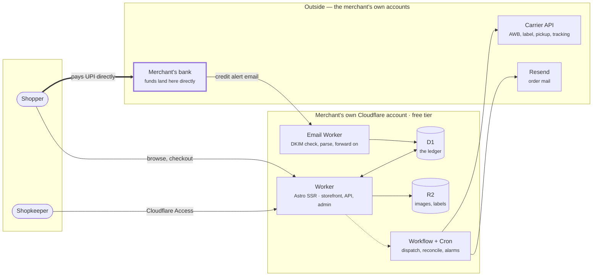
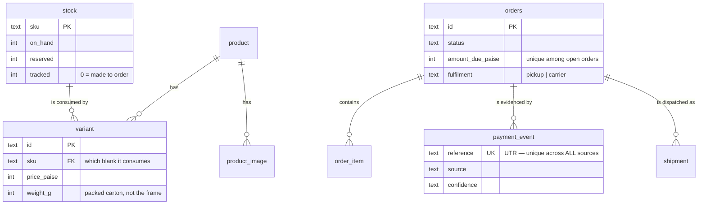

# Architecture

A shop that runs entirely inside one merchant's own Cloudflare account, takes
UPI directly into their own bank account, and dispatches parcels without anyone
clicking a button.

Decisions behind this are recorded in [decisions/](decisions/). This document
describes the *what*; the ADRs explain the *why*.

## System



The software never sits between the shopper and the bank. That is
[ADR-0003](decisions/0003-never-handle-funds.md), and it is the constraint
everything else follows from.

## Modules

```
src/lib/
  money.ts            paise slots, INR format/parse    ← one place for rupees
  catalogue.ts        all product SQL                  ← pages never write SQL
  settings.ts         shopkeeper-editable configuration
  payments/
    types.ts          Evidence, Confidence, Resolution, Fulfilment
    upi.ts            upi:// URI   (the QR encodes the SAME string)
    resolve.ts        THE matcher + settle()           ← one D1 batch
    sources/
      email.ts        bank alert  → Evidence
      statement.ts    CSV upload  → Evidence[]
  banks/
    parsers.json      bank profiles as DATA, fixable without redeploy
    registry.ts       DKIM lookup · extract() · mayAutoSettle()
  shipping/
    types.ts          carrier port + billableWeightG()

migrations/0001_init.sql      schema, with both surprising idioms explained
tests/invariants.test.sql     7 executable proofs — npm run test:schema
seeds/dev.sql                 local fixtures, never applied in production
```

`extract()` is shared by the email and statement sources deliberately: an email
body and a statement cell are both text containing an amount and a reference,
and two extractors would drift.

## Data model



Two things in here are load-bearing and look like mistakes:

**Stock lives on the physical thing, not the sellable variant.** Sixty designs
across three sizes and two colours is six stock rows, not 360 — six numbers a
volunteer can count on a shelf.

**Reservation is unguarded**, relying on `CHECK (reserved <= on_hand)` to raise.
See [ADR-0008](decisions/0008-unguarded-stock-reservation.md); a guarded update
matching zero rows *succeeds* in SQLite and would commit a partial order.

## Free-tier budget

| Resource | Free plan | Where we are |
|---|---|---|
| Worker bundle | 3 MiB gzipped | **145 KB** (4.7%) |
| Worker requests | 100,000/day | static assets are free and unlimited |
| D1 rows read | 5M/day | a product page is a handful |
| D1 rows written | 100,000/day | ~8 per order |
| R2 | 10 GB, zero egress | ~2 MB per product |
| Workflows | 3,000 steps/day | ~4 per order |

Images are served from an **R2 custom domain**, never through the Worker.
Routing them through the Worker is the single change that turns a comfortable
free tier into an overage.

## Flows

- [Payment verification](flows/payment-verification.md)
- [Order lifecycle](flows/order-lifecycle.md)
- [Dispatch](flows/dispatch.md)
