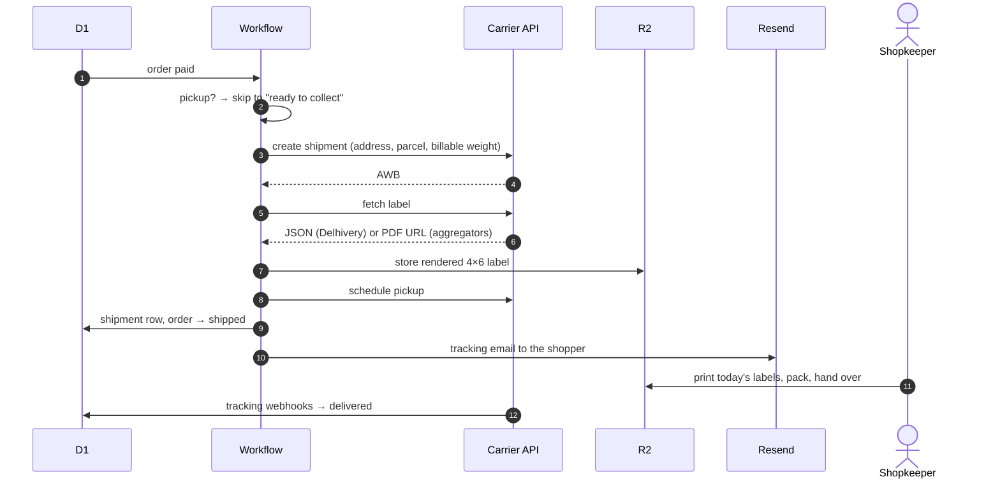

# Dispatch

Everything from a confirmed payment to a parcel with a label on it, with no
human in the loop until someone has to physically pack a box.

See [ADR-0013](../decisions/0013-direct-carrier-over-aggregator.md).



## Why the label is a discriminated union

Carriers disagree about what a label even *is*. Delhivery's packing-slip
endpoint returns JSON that must be rendered — Code128 barcode, 4×6 inch
(100×150 mm) layout — while aggregators hand back a hosted PDF. So the port
returns:

```ts
type Label =
  | { type: 'url';    href: string }
  | { type: 'render'; data: LabelData }
```

Rendering happens once in the shared layer, not per adapter.

## Billable weight

Indian couriers bill on `max(dead weight, L×W×H ÷ 5000)`, rounded up to the
next 0.5 kg. Light bulky goods are priced on their **box**, not their mass — a
45×35×6 cm carton bills at 1.89 kg however little it weighs.

Variant dimensions are `NOT NULL` for exactly this reason. A shop that quotes
from dead weight undercharges on every large item and discovers it weeks later
as a weight-discrepancy debit.

## What still needs a human

Picking, packing, attaching the label, and handing the parcel over. That is the
automation ceiling, and no platform in India beats it. What we remove is the
click — the panel visit that every aggregator still requires per order.

## The failure nobody notices

A carrier wallet running dry means payment succeeds and dispatch silently does
not. A cron watches the balance and alarms the shopkeeper well before zero;
without it, "zero maintenance" would mean "unmonitored".
