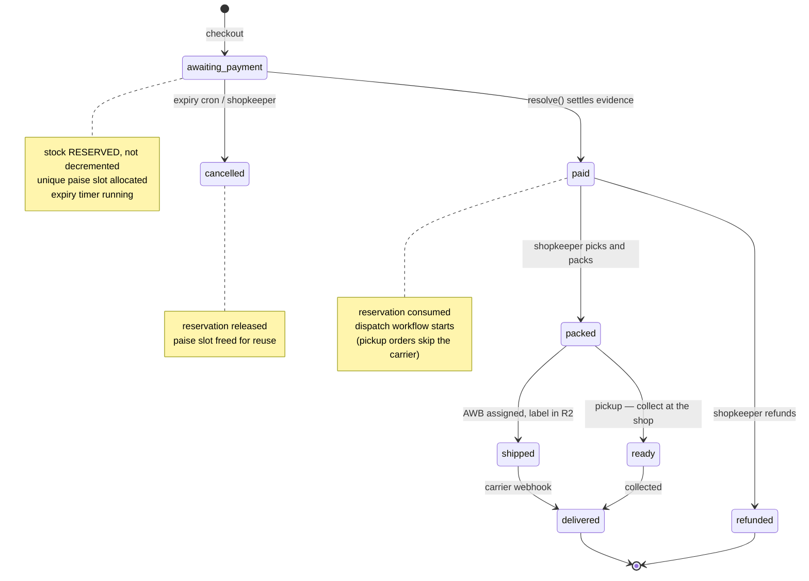

# Order lifecycle

Two fulfilment paths, one payment ladder. Statuses prefixed `cg-` are ours;
the rest are conventional.

## Where the two fulfilment paths differ

| | `pickup` | `carrier` |
|---|---|---|
| Address | none — the schema forbids one | required, and enforced |
| Shipping charge | zero | quoted from a cached zone × weight table |
| After `paid` | straight to *ready to collect* | dispatch workflow |
| Cost to the shop | nothing | freight, billed on volumetric weight |

For a shop selling to its own neighbourhood, pickup may be the most-used
option. It is a first-class checkout choice, not a special case.

## Stock, precisely

- **Reserved** at `awaiting_payment` — never decremented, so an abandoned cart
  cannot permanently consume inventory.
- **Consumed** at `paid`, in the same batch that records the payment.
- **Released** on cancellation or expiry, which also frees the paise slot.

Untracked SKUs (`tracked = 0`, made to order) skip all three.
