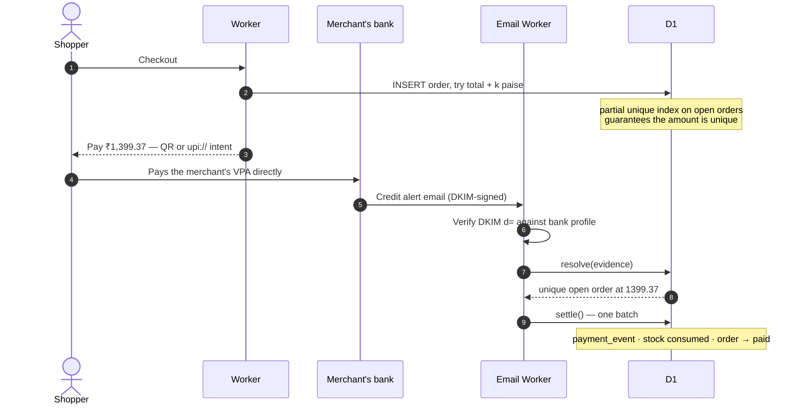
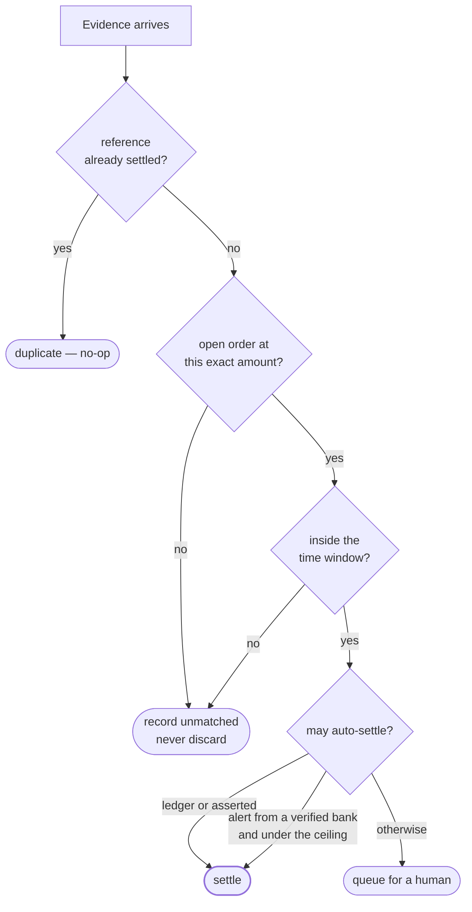

# Payment verification

The shop never touches money. Confirming a payment means observing evidence
that it landed in the merchant's own account, and matching that to an order.

See [ADR-0006](../decisions/0006-one-matcher-many-evidence-sources.md),
[ADR-0007](../decisions/0007-unique-paise-slot.md) and
[ADR-0010](../decisions/0010-bank-trust-tiers.md).

## The happy path — nothing for the customer to type

## What `resolve()` actually decides

Deduplication is on the **reference alone**, not `(source, reference)` — the
same UTR seen by email today and in tomorrow's statement is the same money
([ADR-0009](../decisions/0009-idempotency-on-reference-alone.md)).

## The evidence ladder

A merchant turns on every channel their bank supports; the matcher deduplicates.

| Channel | Confidence | Latency | Coverage |
|---|---|---|---|
| Bank callback | `ledger` | seconds | needs corporate onboarding + a static IP |
| Statement upload | `ledger` | daily | universal |
| Alert email | `alert` | seconds | HDFC confirmed; patchy elsewhere |
| Customer UTR | `claimed` | instant | universal, never settles alone |
| Cash / manual | `asserted` | instant | universal |

A statement row outranks an alert email deliberately: an alert is a
notification about an attempt, a statement is the account's ledger. RBL was
documented sending 47 false "credited" alerts out of 54.
